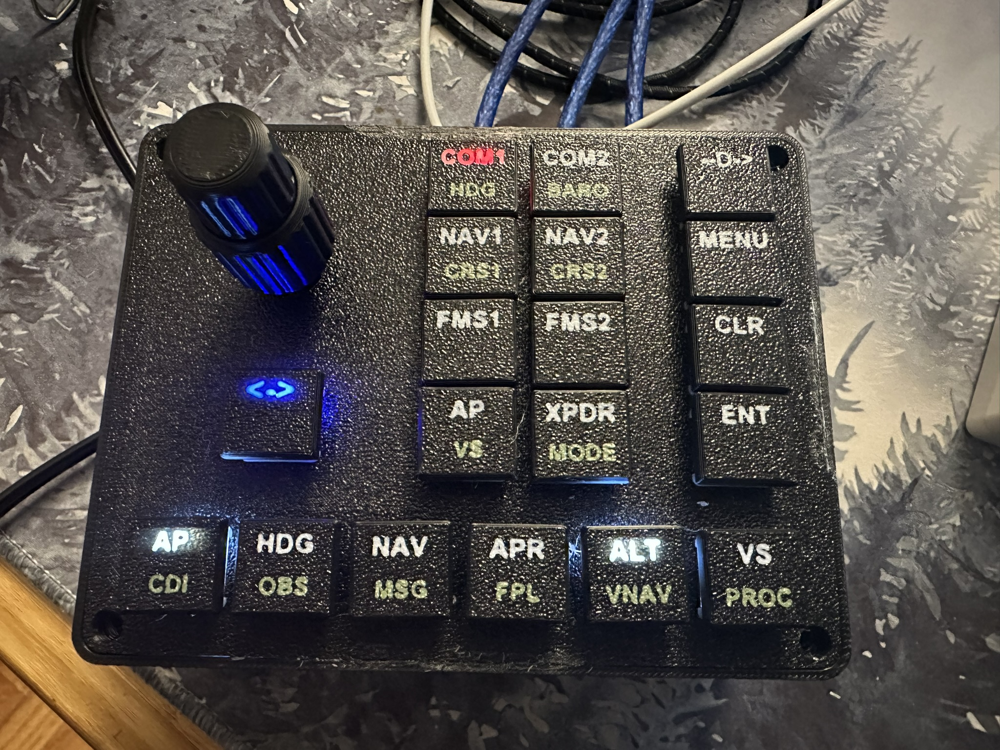

## DIY Button Box
An Octavi Style button box using Mobiflight.

`NOTE: THIS IS A VERY HACKY PROJECT!`

I Assebmled this with one goal:
- ONLY USE PARTS I ALREADY HAD, IE: don't spend a dime except time.

Meaning, it all works great!  BUT I do not have the patience to model things correctly, so if I was doing it again, I would make some changes:
- Add a lip around the box lid, as the current one flexs, needing to be glued down.
- Make more secure arduino nano mounts, and they also needed to be hot glued in place.
- Replace the nanos with one larger board
- Replace the choc switches with a better switch style
- Not put the led lights in the keycaps, because printing keycaps sucks.  (these are held on with hot glue.  On each switch)
- Use all white LEDs, instead of this collection.
- Infact, I would probably just redo every aspect of this.  BUT it WORKS GREAT!
